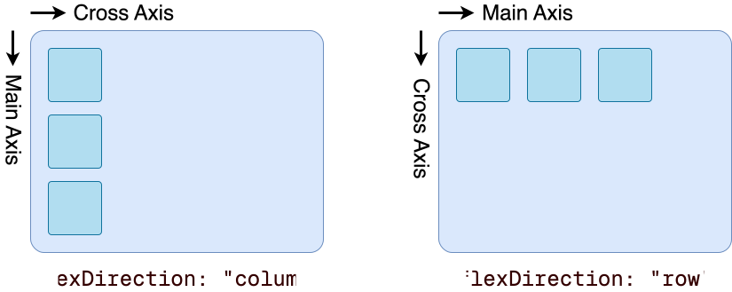

# ECE1778: React Native for Mobile Device Applications


## Lecture 1: 

### Environment Setup

- IOS Simulator:

  1. On MacOS, install Xcode
  2. Important, in Xcode, must open settings -> Component -> Install Platforms, otherwise simulator does not have platform to choose from, and **no error nor indicator**.
  3. `open -a Simulator` in terminal to open simulator

- Android Simulator:

  - [Android  Studio](https://developer.android.com/studio) 
  - [install essentials for AS emulator](https://docs.expo.dev/workflow/android-studio-emulator/#install-watchman-and-jdk)
  
- npx end:

  ```sh
  npx create-expo-app@latest <app_name> --blank
  cd <app_name>
  npx expo start --localhost  # --localhost` is very important
  ```
  
  
  


## Lecture 2: 2025/09/10


- The reason why React Native can work on both IOS and Android is because React Native will translate JS and React into IOS and Android Native elements.


- Most common React Native components:

  ```jsx
  <view>
  
  <Text>
  
  <Button>
  ```


### Flexbox

- React Native uses Flexbox for positioning elements, by default the flexDirection is column, meaning it will flex vertically.

- **READ THIS FLEXBOX style**: Doc: https://reactnative.dev/docs/flexbox


### Styling `StyleSheet.create()`

- Use `StyleSheet` for better organization:

  ```js
  import { Button, StyleSheet, Text, View } from "react-native";
  
  const styles = StyleSheet.create({
  
  })
  ```


- `StyleSheet.create` **has performance optimization**, the item in the Json will only created once and cached, making future use faster.


### All React Native Components

​	https://reactnative.dev/docs/button 


### Display a List of Items

- `ScrollView`: you can scroll, **has limitations**, will display all items at once, good for small list
- `FlatList`: **Solution** to too much items to display, will render only visible items.


### Dynamic Island

- The top of the screen is blocked by the Dynamic Island. To make things work automatically with DI, use SafeAreaProvider.

  `npm install react-native-safe-area-context` 

  ```js
  import { SafeAreaProvider, SafeAreaView } from "react-native-safe-area-context"
  
  return (
   <SafeAreaProvider>
     <SafeAreaView>
     	<Text>Page content</Text>
     </SafeAreaView>
   </SafeAreaProvider>
  );
  ```


### Alert `Alert.alert()`

- Use `Alert.alert()` to prompt for change and errors.

  ```js
  import React from 'react';
  import {StyleSheet, Button, Alert} from 'react-native';
  import {SafeAreaView, SafeAreaProvider} from 'react-native-safe-area-context';
  
  const App = () => {
    const createTwoButtonAlert = () =>
      Alert.alert('Alert Title', 'My Alert Msg', [
        {
          text: 'Cancel',
          onPress: () => console.log('Cancel Pressed'),
          style: 'cancel',
        },
        {text: 'OK', onPress: () => console.log('OK Pressed')},
      ]);
  
    return (
      <SafeAreaProvider>
        <SafeAreaView style={styles.container}>
          <Button title={'2-Button Alert'} onPress={createTwoButtonAlert} />
        </SafeAreaView>
      </SafeAreaProvider>
    );
  };
  
  const styles = StyleSheet.create({
    container: {
      flex: 1,
      justifyContent: 'space-around',
      alignItems: 'center',
    },
  });
  
  export default App;
  ```

  


## Lecture 3: 2025/09/17


### Why `StyleSheet`?

- **Performance**: Styles are cached in the native layer
- **Readability**: Centralized style definitions
- **Maintainability**: Easy to reuse across components


### ``StyleSheet.compose()``

Return an Array of styles, combines input style1 and style2, with style2 as priority. Handle null input.

```typescript
static compose(style1: Object, style2: Object): Object | Object[];
```

- Returns `style1`, `style2`, `[style1, style2]`, or `null`, depending on which is null
- If both are defined, `style2` overrides any conflicts from `style1`

We can actually use `**const** container = [page.container, lists.listContainer];`, but compose do extra checks. **so just always use `StyleSheet.compose()`**


### `StyleSheet.flatten()`

Combine an Array of styles into a single one.

```js
const page = StyleSheet.create({
  container: { flex: 1, backgroundColor: "white" },
});

const lists = StyleSheet.create({
  listContainer: { backgroundColor: "skyblue" },
});

const container = StyleSheet.flatten([page.container, lists.listContainer]);
```


Create a new style object

```js
{
  "flex": 1,
  "backgroundColor": "skyblue"
}
```


#### StyleSheet: Rule of Thumb

- Final product / UI rendering: Use `compose()` or an array of styles
- Debugging / needing raw values: Use `flatten()`


### Separate color code in alternative file

- Separation of concerns:
  - `styles/`: Define how components look (layout, spacing, text styles)
  - `constants/`: Store reusable values used across app
- Reusability: Colors can be used in styles, components, or even logic (e.g., status-based coloring)

Example Project Structure
```
project-root/
├── App.tsx
├── constants/
│   ├── colors.ts
│   └── fonts.ts
├── styles/
│   └── globalStyles.ts
```

`colors.ts`: Example

```ts
// constants/colors.ts
export const colors = {
  primary: "#4CAF50",
  secondary: "#FFC107",
  background: "#F5F5F7",
  titleText: "#8A646E",
  text: "#333",
  error: "#F44336",
};
```


### Flexbox: Core Properties

**Container Properties**

- `flexDirection`: Direction of main axis
  
  - `"column"` (default): Children stacked vertically
  
  - `"row"`: Children stacked horizontally
  
    




- `justifyContent`: Align children along **main axis**
  - `flex-start` (default): Start of main axis
  - `center`: Center of main axis
  - `space-between`: Evenly spaced across main axis
  - …
- `alignItems`: Align children along **cross axis**
  - Also has `flex-start` `center` `space-between`...


**Child Properties**

- `flex`: Proportion of space

  ```tsx
  <View style={[styles.container, { flexDirection: "column" }]}>
    <View style={{ flex: 1, backgroundColor: "red" }} />    // takes 1/6 space
    <View style={{ flex: 2, backgroundColor: "blue" }} />   // takes 2/6 space
    <View style={{ flex: 3, backgroundColor: "green" }} />  // takes 3/6 space
  </View>
  ```

- `width` / `height`: Fixed size is still respected
- `alignSelf`: Override `alignItems` for a single child


### `<Button>` 

`<Button>` has very limited customization, can only change button.


### `<Pressable>`

`<Pressable>`  is better than `<Button>`

- Full control over layout and appearance
- Can handle tap interaction (`onPress`)

  ```
  <Pressable onPress={() => console.log("Pressed!")} >
  	<Text>Click Me</Text>
  </Pressable>
  ```

- Can style for different states (`pressed`)
- `pressed`: Touch → `pressed` is `true`

  ```tsx
<Pressable
    style={({ pressed }) => [styles.button, pressed && styles.buttonPressed]}
    onPress={...}
  >
  ```

- Can Wrap another object, like `<Image>`

  ```tsx
  <Pressable onPress={() => Alert.alert("Image pressed!")}>
    <Image
      source={require("./assets/avatar.png")}
      style={{ width: 100, height: 100 }}
    />
  </Pressable>
  ```


### `<Image>`

- Use `source` prop: Currently support `png`, `jpg`, `jpeg`, `bmp`, `gif`, `webp`, `psd` (iOS only)

  - Local: `source={require("./assets/avatar.png")}`

  - Remote: `source={{ uri: "https://reactnative.dev/img/tiny_logo.png" }}`


### `<TouchableOpacity>`

A wrapper that dims the view when pressed

`<Pressable>` can replicate `TouchableOpacity` behavior using `pressed`


### `<Modal>`

A page that fully cover the current page.

Core Props:

- `visible` (boolean): Whether the modal is shown
- `onRequestClose` (function): Required on Android
  - Triggered when the system attempts to close the modal (e.g. back button)
- `animationType`: How modal appears/disappears
  - `"none"`, `"slide"`, `"fade"`
- `transparent` (boolean): Make background transparent


```tsx
<Modal
  visible={modalVisible}
  onRequestClose={() => setModalVisible(false)}
  animationType="slide"
  transparent={true}
>
  <Text>Hello from Modal</Text>
</Modal>
```


## Lecture 4: 2025/09/24

### Responsive design: portrait and landscape


### Light / Dark Mode

- Static (Bad, not responsive)

    ```ts
    import { Appearance } from "react-native";
    
    const colorScheme = Appearance.getColorScheme();
    console.log(colorScheme); // "light" or "dark"
    ```
    
- Reactive (React hook):

    ```tsx
    import { useColorScheme, View } from "react-native";
    
    export default function App() {
      const scheme = useColorScheme();  // hook on change theme
      return (
        <View style={{ backgroundColor: scheme === "dark" ? "#000" : "#fff" }} />
      );
    }
    ```

    


### Navigator

```bash
npm install @react-navigation/native
npx expo install react-native-screens react-native-safe-area-context
```


```ts
// screens/HomeScreen.tsx
import { View, Text } from "react-native";
import { globalStyles } from "../styles/globalStyles";

export default function HomeScreen() {
  return (
    <View style={globalStyles.container}>
      <Text style={globalStyles.headerText}>Home Screen</Text>
    </View>
  );
}

// screens/DetailsScreen
// similar to HomeScreen()

// App.tsx
import { createStaticNavigation } from "@react-navigation/native";
import { createNativeStackNavigator } from "@react-navigation/native-stack";
import HomeScreen from "./screens/HomeScreen";
import DetailsScreen from "./screens/DetailsScreen";

const RootStack = createNativeStackNavigator({
  initialRouteName: "Home",
  screens: {
    Home: HomeScreen,
    Details: DetailsScreen,
  },
});

const Navigation = createStaticNavigation(RootStack);

export default function App() {
  return <Navigation />;
}
```


## Lecture 5: October 1, 2025

### Expo Router

#### Setup:

```sh
npx create-expo-app@latest --template blank-typescript

npx expo install expo-router react-native-safe-area-context react-native-screens expo-linking expo-constants expo-status-bar

# in package.json
{
  "main": "expo-router/entry",
}
```

Replace `App.tsx` with ` app/_layout.tsx` (Root layout)

​	TODO: `app.json`?


#### Expo Router Key Implementation 

- File-based routing: Screens are files inside app/ directory
- Built on React Navigation: Simpler setup
- Setup: Add dependencies, set `"main": "expo-router/entry"`, define a scheme
  - Navigation structure
    - `app/_layout.tsx` defines root `<Stack>` (`App.tsx`)
    - `app/index.tsx` defines initial route (`HomeScreen.tsx`)
- **Automatic types**: No need to define a type and pass to generic navigator. Expo Router infers route + param types from file structure
- **Navigation API**: Use the global `router.push("/path")` (vs. `navigation.navigate("Name")` in React Navigation)


Expo Router = React Navigation + file-based routing + automatic type safety


#### Dynamic Routes

Square brackets `[ ]` in filenames = dynamic routes

```tsx
app/details/[id].tsx
```

- `/details/1`→ opens `app/details/[id].tsx`
- `/details/abc` → also opens `app/details/[id].tsx`


```tsx
import { useLocalSearchParams } from "expo-router";

export default function Details() {
  // Read dynamic route parameters inside a screen
  const { id } = useLocalSearchParams();  // /details/12 → { id: "12" } (string)
  ...
}
  
```


```tsx
import { View, Text } from "react-native";
import { router } from "expo-router";
import { globalStyles } from "../styles/globalStyles";
import PrimaryButton from "../components/PrimaryButton";

export default function Home() {
  return (
    <View style={globalStyles.container}>
      <Text style={globalStyles.headerText}>Home Screen</Text>
      <PrimaryButton onPress={() => router.push("/details")}>
        Go to Details
      </PrimaryButton>
      {// Navigate with Param}
      <PrimaryButton onPress={() => router.push("/details/12")}>  
        Go to Details 12
      </PrimaryButton>
    </View>
  );
}
```


####  Expo Router Group

```sh
app/
 └── (tabs)/
      ├── profile.tsx
      └── settings.tsx
```

- URL `/profile` → `app/(tab)/profile.tsx`
- URL `/settings` → `app/(tab)/settings.tsx`


### Expo Router vs. React Navigation

| Feature          | React Navigation                          | Expo Router                   |
| :--------------- | :---------------------------------------- | :---------------------------- |
| Routing Style    | Manual config (e.g., `<Stack.Navigator>`) | File-based (`app/[id].tsx`)   |
| Setup Complexity | Explicit screens, params types            | Auto-routes, inferred types   |
| Navigation API   | `navigate("Name", params)`                | `router.push("/path")`        |
| Params           | `route.params`                            | `useLocalSearchParams()`      |
| Type Safety      | Manual `ParamList` definitions            | Automatic from file structure |


## Lecture 6: October 8, 2025

### State Management

#### Tools

- **Context API**: Global state without prop drilling
- **`useReducer`**: Managing complex local state
- **Redux Toolkit**: Scalable global state for larger apps


#### Context API

React’s built-in solution for sharing state across components

- **No external libraries**: Lightweight and always available in React/React Native
- **Wrap parts of your app**: Components inside this wrapper can access shared state directly
- **Ideal for**: Medium-sized apps or simple global data

[Context API Doc](https://react.dev/learn/passing-data-deeply-with-context)

##### Usage

1. **Create Context**

   ```
   const MyContext = createContext(defaultValue)
   ```

   - Define a shared “container” for state
   - Set an optional default value

2. **Provider**

   ```
   <MyContext.Provider value={someValue}>
     <ChildComponent />
   </MyContext.Provider>
   ```

   - Wrap components that should access the shared state
   - Pass the current value to all its descendants

3. **Consumer**

​	Use `useContext(MyContext)` to read or use the shared value inside any child component


##### Example

```tsx
import { createContext } from "react";

export type ThemeContextType = {
  theme: "light" | "dark";
  toggleTheme: () => void;
};

const ThemeContext = createContext<ThemeContextType>({
  theme: "light",
  toggleTheme: () => {},
});
```


##### Limitations:

Context API works well for simple global state (e.g., theme, user settings), but can become challenging as app grows:

- All consumers re-render on any change → May affect performance
- Not ideal for complex state logic → Better to use `useReducer` or Redux


#### useReducer

An alternative to `useState` when states are getting messier?

Use with Context API


#### Redux Toolkit

For large projects.

##### Setup

```sh
npm install @reduxjs/toolkit react-redux
```


## Lecture 7:


## Lecture 8:


## Lecture 9:


## Lecture 10:

