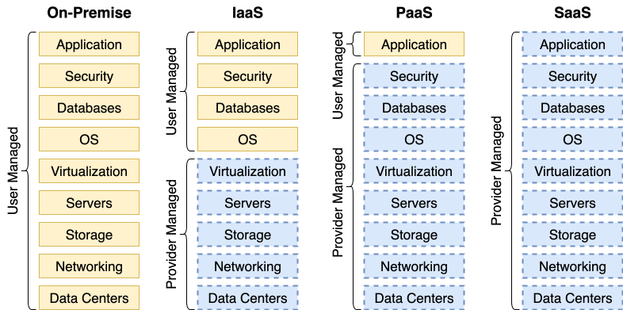
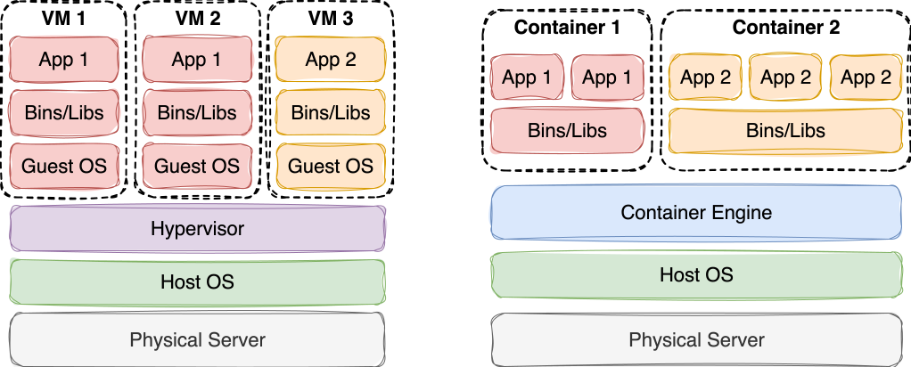

# ECE1779: Cloud Computing

## Lecture 1: September 5, 2025

### Topics

- **Service Models**: IaaS, PaaS, SaaS
- **Containerization**: [Docker](https://www.docker.com/)
- **Orchestration**: [Docker Compose](https://docs.docker.com/compose/), [Docker Swarm](https://docs.docker.com/engine/swarm/), [Kubernetes](https://kubernetes.io/)
- **Edge Computing**: [Fly.io](https://fly.io/docs/)
- **Serverless Computing**


### Edge Computing

A distributed computing model that brings computation and data storage closer to users/devices to reduce latency and bandwidth use

- Key Features:
  - **Global Distribution**: Edge nodes (servers closer to users) in multiple regions
  - **Decentralized Processing**: Data processed near source, not central data centers
  - **Low Latency**: Request response <50ms vs. 200ms+ in traditional cloud


#### Cloud Service Models

####  **Infrastructure as a Service (IaaS)**

  - Provides virtualized infrastructure (e.g., VMs, storage, networking)
  - Infrastructure: Foundational physical and virtual resources needed to run computing systems

    - **Compute**: Physical servers, virtual machines (VMs), CPUs
    - **Storage**: Hard drives (HDDs), Solid-State Drives (SSDs), block/object storage
    - **Networking**: Routers, switches, firewalls, IP addresses, load balancers
    - **Facilities**: Data centers, power, cooling

  - Key Features:
    - **Control**: User manages OS, runtime, apps; provider handles hardware
    - **Scalability**: Dynamically add or remove resources based on demand; pay only for what you use
    - **Use Cases**: Web hosting, test/dev environments 
  - Example: [DigitalOcean Droplets](https://www.digitalocean.com/products/droplets) provide VMs that users can fully control


​    
#### **Platform as a Service (PaaS)**
  - Provides a managed environment for application development and deployment
  - Key Features:
    - **Control**: User manages code; provider handles servers, OS, networking
    - **Scalability**: Auto-scales apps for demand
    - **Use Cases**: Web/mobile apps, IoT apps
  - Example: [Fly.io](https://fly.io/) deploys apps globally on edge nodes for low latency


``` bash
curl -X POST https://ece1779-a3-1003683114.fly.dev/tasks -d \
'{
	"title":"Task 1",
	"description":"Do something",
	"status":"pending"
}'
-H "Content-Type: application/json" 
-H "Authorization: Bearer ece1779a3apikey"
```

##### IaaS vs. PaaS

|             | IaaS            | PaaS               |
| :---------- | :-------------- | :----------------- |
| Management  | User: OS        | Provider: OS       |
| Control     | High (OS, apps) | Medium (code)      |
| Scalability | High, manual    | High, auto-scaling |


#### **Software as a Service (SaaS)**

- Ready-to-use applications delivered via web browser
- Key Features:
  - **Ease of Use**: No installation, provider handles all maintenance
  - **Subscription-Based**: Fixed monthly fees, predictable costs
  - **Use Cases**: Email, collaboration tools
- Example: [Google Workspace](https://workspace.google.com/)
- Service Model Breakdowns


## Lecture 2: September 12, 2025

- Edge computing challenges: Security, data consistency

- Today: Infrastructure as a Service (IaaS), important for A1

- A1: deploy a web application on VM

  

### IaaS Resources:

  - Storage
  - Network
  - Management Tools


### Storage Types
#### Storage: **Object Storage** 

- Stores unstructured data as discrete “objects” (files + metadata) 
- Used for: images, videos, backups, static website files Scalable, durable, and accessed via HTTP-based APIs 
- Examples: **AWS S3**, **DigitalOcean Spaces** Think of it as a big web-accessible bucket of files

#### Storage: **Block Storage** 
  - Provides raw storage volumes, like a virtual hard drive 
  - Used for: databases, OS disks, applications needing low latency reads/writes Attached to VMs; requires formatting (creating a file system) and mounting (connecting the block storage to a folder to use it like a regular folder) like a local disk 
  - Examples: AWS EBS, DigitalOcean Volumes Think of it as plugging an external SSD into your VM

#### Storage: **File Storage** 

  - Provides a shared file system, accessible by multiple VMs over the network Access: Applications and users access data using file paths (e.g., /mnt/shared/project/report.md) 
  - Use Cases: Team collaboration, legacy apps 
  - Examples: Amazon EFS, Google Filestore, Azure Files Think of it as a cloud-based shared drive that many servers can mount at the same time


### **Network:**
  - Virtual Private Cloud (**VPC**)
  - **Load Balancer**: distribute traffic across VMs
  - **Firewall & Security Group**
  - **Public/Private IPs, DNS** (Domain Name System)


### **Management Tools**
  - **Web Dashboard**: A point-and-click interface in browser 
  - **CLI** (Command-Line Interface): A text-based tool where you type commands instead of clicking Useful for faster, repeatable actions (e.g., doctl compute droplet create ) 
  - **API** (Application Programming Interface): A way for software to talk to the cloud directly Used for automating tasks

  - Monitoring & Logging View usage data, performance metrics 

  - Get alerts when something goes wrong Snapshots & Backups 

  - Save the current state of your system 

  - Use Cases: Recovery, rollback, cloning environments


### **DigitalOcean Ecosystem** 

  - Compute: Droplets for running apps and databases 
  - Storage: Volumes Block Storage, Spaces Object storage 
  - Networking: [VPC](https://www.digitalocean.com/products/vpc), [Cloud Firewalls](https://www.digitalocean.com/products/cloud-firewalls), [Load Balancer](https://www.digitalocean.com/products/load-balancers), etc 
  - Management Tools: Web dashboard: https://cloud.digitalocean.com/login 
  - doctl CLI and APIs (link in the slides)
  - Backups and Snapshots (link in the slides)

  

### **Host a Web Server** 

  - [**Nginx**](https://nginx.org/en/docs/): Flexible, high-performance, open-source web server and reverse proxy
  - Install Nginx:
    - `apt install nginx -y`
  - Verify Nginx installation:
    - `systemctl status nginx`
  - Visit `http://<droplet-ip>` in browser, ou should see the default Nginx welcome page
  - Nginx is automatically started right after installation
  - Manually start Nginx:
    - `systemctl start nginx`
  - Also enabled to start on boot by default:
    - `systemctl is-enabled nginx  # Check if start on boot` 
  - Manually enable Nginx on boot:
    - `systemctl enable nginx`

  - New home page: 
    - `echo '<h1>Hello!</h1>' > /var/www/html/index.html` 


### **PostgreSQL**

  - Open-source relational database system

  - Managed via command line tool psql or GUI tools (e.g., [pgAdmin](https://www.pgadmin.org/))

  - Can run on DigitalOcean Droplets as an IaaS database solution

  - Install PostgreSQL on Droplet:

    - `apt install postgresql -y`

  - Check PostgreSQL service status:

    - `systemctl status postgresql`

  - Manually start PostgreSQL (if needed):

    - `systemctl start postgresql`

  - Start psql as the postgres user (default admin):

    - `sudo -u postgres psql`

  - Create and connect to a database:

    ```sql
    CREATE DATABASE demo_db;
    \c demo_db                -- connect to database demo_db
    \l                        -- list all databases
    \dt                       -- list tables in current schema
    \d tablename              -- describe a table’s columns, constraints, indexes
    \du                       -- list roles/users
    
    
    \q                        -- quit psql
    ```

  - Create a table and insert a row:

    ```sql
    CREATE TABLE users (id SERIAL PRIMARY KEY, name VARCHAR(100));
    INSERT INTO users (name) VALUES ('Test User');
    ```

    

    

### **PHP**

  - Install PHP with PostgreSQL support:

    - `apt install php-fpm php-pgsql -y`

  - Some PHP pg function:

    - php-fpm: Handle PHP script execution 
    - php-pgsql: Enable PHP to connect to PostgreSQL 
    - pg_connect: Open a PostgreSQL connection 
    - pg_close: Close a PostgreSQL connection 
    - pg_query: Send an SQL query 
    - pg_fetch_assoc: Fetch a row as an associative array
    - https://www.php.net/manual/en/book.pgsql.php

  - `/var/www/html/query.php` 

    ```php
    <?php
    $dbconn = pg_connect("host=localhost dbname=demo_db user=postgres");
    $result = pg_query($dbconn, "SELECT * FROM users");
    
    echo "<h1>Users Table</h1>";
    while ($row = pg_fetch_assoc($result)) {
        echo $row['id'] . " - " . $row['name'] . "<br>";
    }
    
    pg_close($dbconn);
    ?>
    ```

    

  - Configurate nginx 

    - main entry: `/etc/nginx/nginx.conf`

    - **Debian practice** to host a new site:

      1. Make change in `/etc/nginx/sites-available/default`

         ```nginx
         server {
             listen 80 default_server;
             listen [::]:80 default_server;
             root /var/www/html;
             index index.php index.html index.htm;
             server_name _;
             location ~ \.php$ {
                 include snippets/fastcgi-php.conf;
                 fastcgi_pass unix:/run/php/php8.4-fpm.sock;
             }
         }
         ```

      2. Link `/etc/nginx/sites-enabled/default` to above file to make it online.

      3. Restart nginx: `systemctl restart nginx`

  - To check error message log: `sudo tail -n 20 /var/log/nginx/error.log`

  - Make php able to connect psql without a password, through local network, by **peer authentication**.

    - For localhost connect, matches the system user to a PostgreSQL role with the same name, grants access without a password, using OS-level user authentication 

    - ```bash
      sudo -u postgres psql
      ```

    - ```sql
      CREATE ROLE "www-data" WITH LOGIN;
      # www-data: Ubuntu’s default system user for running Nginx and PHP-FPM processes
      GRANT CONNECT ON DATABASE demo_db TO "www-data";
      \c demo_db
      GRANT SELECT ON TABLE users TO "www-data";  -- low-privilege
      GRANT INSERT, UPDATE, DELETE ON TABLE users TO "www-data";  -- write-privilege
      ```

    - Update php code: `$dbconn = pg_connect("dbname=demo_db user=www-data");`


### **Create Volume**

  	- DigitalOcean dashboard: Navigate to Droplets > Volumes > Add Volume
  	
  	- Set size to 1 GB 
  	- Name volume 
  	- Select “Automatically Format & Mount” 
  	- Choose Ext4 filesystem (default on most Linux) 
  	- Volume mounts to /mnt/


### **Snapshot**: 
  - DigitalOcean dashboard: Navigate to Droplets > Snapshots > Take Snapshot
  - Capture entire Droplet state (OS, files, volumes)
  - Schedule regular snapshots.


## Lecture 3: September 19, 2025

### DigitalOcean API Access

Generate an API token:

- Navigate to dashboard: API → Tokens → Generate New Token
- Select scope: `Read Only` for querying
- Save token securely (e.g., in a password manager, never commit to GitHub)


- use `curl` with bearer token included to interact with DigitalOcean API:

    ```bash
    curl -X GET -H "Authorization: Bearer <your-api-token>" \
    "https://api.digitalocean.com/v2/droplets/<droplet-id>"
    ```

- Better, store api token in system path:

    ```bash
    export DO_TOKEN="your-api-token"
    
    curl -X GET -H "Authorization: Bearer $DO_TOKEN" \
    "https://api.digitalocean.com/v2/droplets/<droplet-id>"
    ```


- Process JSON responses in terminal:

  ```bash
  sudo apt-get install jq
  
  curl -s -X GET -H "Authorization: Bearer <your-api-token>" \
  "https://api.digitalocean.com/v2/droplets/<droplet-id>" | jq -r '.droplet.status'
  ```


### Python API

```python 
import boto3

# ===== User Configuration =====
BUCKET_NAME = "my-bucket" # Replace with your Spaces Bucket name
REGION = "tor1"           # Region of your Space
FILE_PATH = "hello.txt"   # File you want to upload

ACCESS_KEY_ID = "your-access-key-id"
SECRET_KEY = "your-secret-key"
# ===============================

# Create a session with Spaces
session = boto3.session.Session()
client = session.client(
    "s3",
    region_name=REGION,
    endpoint_url=f"https://{REGION}.digitaloceanspaces.com",
    aws_access_key_id=ACCESS_KEY_ID,
    aws_secret_access_key=SECRET_KEY
)

# Upload file
client.upload_file(FILE_PATH, BUCKET_NAME, "uploads/hello.txt")
print("File uploaded to Spaces Bucket!")

# Download it back
client.download_file(BUCKET_NAME, "uploads/hello.txt", "hello_copy.txt")
print("File downloaded from Space Bucket!")
```


### PaaS Providers

- [**Vercel**](https://vercel.com/): Free tier, developer-friendly, ideal for web apps
- [**Google App Engine**](https://cloud.google.com/appengine): Fully managed PaaS for web and mobile backends
- [**Heroku**](https://www.heroku.com/): AI-centric PaaS, streamlined for building AI-driven apps and agents
- [**AWS Elastic Beanstalk**](https://docs.aws.amazon.com/elastic-beanstalk/): Enterprise-grade, integrates with AWS ecosystem
- [**Microsoft Azure App Service**](https://learn.microsoft.com/en-us/azure/app-service/overview): Strong integration with Microsoft tools


### PaaS Example: Vercel Usage

- Three simple steps
  - Set up Vercel account and CLI (`vercel login`)
  - Created a Node.js app with Express and `vercel.json`
  - Deployed with one command: `vercel`


## Lecture 4: September 26, 2025

### Containers vs. VMs

- **VMs**: Run a full guest OS on a hypervisor (e.g., VMware, KVM), simulating hardware

  - **Hypervisor**: Software layer that allows multiple VMs to share the same physical hardware

    

- **Containers**: Share the host OS kernel, isolating apps at process level




### Docker

- **Dockerfile**: Text file defining how to build the environment
  - Write a Dockerfile to define the application environment
- **Image**: Read-only snapshot built from a Dockerfile
  - Build a Docker image from the Dockerfile: `docker build -t <image-name> .`
- **Container**: Running instance of an image
  - Run the image as a container: `docker run <image-name>`


#### Dockerfile

Instructions:

- FROM: Specify the base image (e.g., node:22)
- WORKDIR: Set working directory inside the container
- COPY: Copy files to container
- RUN: Execute commands during the image build process
- EXPOSE: Document the port the container listens on
- CMD: Set the default command to run when the container starts

[Docker Reference Official Document](https://docs.docker.com/reference/dockerfile/#expose)

```dockerfile
# Use official Node.js image
FROM node:22

# Set working directory
WORKDIR /app

# Copy dependency definitions
COPY package*.json ./

# Install dependencies
RUN npm install

# Copy application code
COPY . .

# Expose port
EXPOSE 3000

# Run the application
CMD ["npm", "start"]
```


#### Where are Image Files

- Write `Dockerfile` and build image with `docker build -t <image-name> .`

- Docker stores images in its internal storage, managed by the Docker Engine
  - Linux: `/var/lib/docker/overlay2`
  - MacOS/Windows: `Open Docker Desktop > Settings > Resources > Disk image location`

- List built images: `docker images`


#### Run container

`docker run <image-name>`

```bash
docker run -d -p 3000:3000 my-node-app  # maps local 3000 to container 3000
```


#### Store image in cloud

- A **Docker registry** stores and shares Docker images
  - [Docker Hub](https://hub.docker.com/)

```sh
docker login
# Tag the image: 
# docker tag <image-name> <docker-username>/<docker-hub-repo-name>:<tag-name>
docker tag my-node-app cying25/ece1779-images:v1.0

# docker push <docker-username>/<docker-hub-repo-name>:<tag-name>
docker push cying25/ece1779-images:v1.0

# docker pull <docker-username>/<repo-name>:<tag-name>
docker pull cying25/ece1779-images:v1.0
```


#### Docker Image and Container Key commands

- Build: `docker build -t <image-name> .`

- Run: `docker run -d -p <host-port>:<container-port> <image-name>`

  - `-d`: Detached mode (frees terminal)

- List running containers: `docker ps`

  - `-a`: list all containers

- Stop container: `docker stop <container-id>`

- View logs: `docker logs <container-id>`


Full CLI reference: `docs.docker.com/reference/cli/docker/`


#### Docker Compose

Start a bunch of services, multiple containers, together as a whole system

Check A2 `compose.yaml`


#### Docker Compose Key Commands

- `docker compose up`: Start all services defined in `compose.yaml`
- `docker compose down`: Stop and remove running services, networks (volumes persist)
- `docker compose logs`: View logs
- `docker compose ps`: List all the services along with their current status

Full Reference: `https://docs.docker.com/reference/cli/docker/compose/`


#### Good to know (OS Resources)

- Linux laptop: Containers directly share the Linux kernel
- On macOS/Windows laptop: Docker Desktop runs a lightweight Linux VM, and containers share that VM’s Linux kernel (not macOS/Windows kernel)


## Lecture 5: October 3, 2025

### Store Credentials 

`.env` is still not safe. Solution is docker secret


### Docker Service Health Check

```yaml
services:
	db:
        image: postgres:latest
        ...
        healthcheck:
            test: ["CMD-SHELL", "pg_isready -U ${DB_USER} -d ${DB_NAME}"]
            interval: 5s
            timeout: 5s
            retries: 5
            start_period: 10s
            
    api:
        depends_on:
            db:
                condition: service_healthy
                restart: true
```

- `pg_isready`: PostgreSQL utility included in `postgres` image
  - Check if the database is accepting connections
- `interval`: Time interval between health checks
- `timeout`: Maximum time allowed for the health check command to complete. If timeout exceeded, the check is considered a failure

- `retries`: Number of consecutive failures after which the container is considered “unhealthy”
- `start_period`: Time given to container to start before healthchecks begin


- `restart: true`: Ensure that if `db` is updated or restarted, `api` service is also restarted automatically, ensuring it re-establishes connections or dependencies correctly


### Docker Swarm

#### Key Concepts in Swarm

- **Node**: Machine in the swarm
  - **Manager**: Orchestrate the swarm, assigns tasks
  - **Worker**: Run task (container) assigned by manager
- **Service**: Define desired state for containers
  - State: Image, number of replicas, ports, and more
- **Task**: Individual container running a service’s image
  - Each task is one container, scheduled on a node
- **Stack**: Compose-like deployment of multiple service

**Hierarchy**: Each **stack** can have multiple **services**, each **service** has multiple **tasks**, and Swarm spreads those tasks across **multiple nodes** — not confined to one node.


### Swarm Setup

```sh
# Manager
docker swarm init

# Worker node
docker swarm join --token <token> <manager-ip>:2377  # use token from init output

# Verify from manager
docker node ls

# after
docker service create --name app --replicas 3 -p 3000:3000 my-node-app

docker service ps app       # List 3 tasks (containers)
docker service scale app=5  # ps app now shows 5 tasks

docker service update --force app  # Force Redeploy

docker service rm app       # clean up
docker swarm leave          # Worker leave swarm
docker swarm leave --force  # Manager leave swarm
```


## Lecture 6: October 10, 2025

### MultiPass

Lightweight tool to generate cloud-style Ubuntu VMs quickly on Linux, macOS and Windows

Doc: [documentation.ubuntu.com/multipass/en/latest/](https://documentation.ubuntu.com/multipass/en/latest/)

Install: [canonical.com/multipass/install](https://canonical.com/multipass/install)

```sh
# Launch manager node VM
multipass launch --name manager --cpus 1 --memory 1G --disk 15G

# Launch worker node VM
multipass launch --name worker1 --cpus 1 --memory 1G --disk 15G

# Verify VMs
multipass list

# Access the manager VM
multipass shell manager

## install docker engine and grant ubuntu user permission to access Docker daemon
sudo usermod -aG docker ubuntu
newgrp docker

# Delete VMs
multipass delete manager worker1  # Disk NOT yield yet, allow recovery

# Recover deleted VM
multipass recover manager

# Permanently delete all instances
multipass purge
```


### Docker Rolling Update 

No Down Time Update to New Image Version

```yaml
services:
    app:
    	image: cying25/ece1779-images:v1.0
    	deploy:
            replicas: 2
            update_config:
                parallelism: 1
                delay: 10s
                
networks:
    app-network:
        driver: overlay
```

- `deploy`: Specifies replicas, update strategy
- `replicas: 2`: Specifies 2 instances of `app` service (2 containers)
- `update_config`: Configures rolling updates with
  - `parallelism: 1`: Update one container at a time
  - `delay: 10s`: 10-second delay between updates
- `overlay`: Enables multi-host networking

```sh
docker service update --image cying25/ece1779-images:v1.1 <stack name>
```


### Deploy Docker Stack

```sh
docker swarm init  # On manager
docker swarm join --token <token> <manager-ip>:2377  # On worker

docker stack deploy --compose-file <compose>.yaml <stack name>

# Check services
docker service ps stackdemo_app  # List 3 containers
docker service ps stackdemo_db   # List 1 container

docker stack services <stack name>  # All services?

# Remove stack
docker stack rm <stack name>
```


### Fly.io

Platform-as-a-Service (PaaS) for deploying Docker containers globally

- **Global Deployment**
  - Use **Anycast routing** to direct traffic to the nearest region
- **Container-Based**
- **Scaling and Load Balancing**
  - **Auto-scaling**: Adjust instances based on demand
  - **Load balancing**: Distribute traffic across regions and instances
  - Built-in **HTTPS** with automatic SSL certificates

#### Fly.io Core Components

- **Anycast Network**: Route user requests to the nearest region
- **Fly Proxy**: Manage traffic, HTTPS, and load balancing
- **Regions**: Data centers (e.g., yyz, lhr, sin) hosting apps
- **Fly Machines**: Lightweight VMs running Docker containers
- **Fly App**: An abstraction for a group of Fly Machines running your code on Fly.io
- **Fly Volumes**: Local persistent storage for Fly Machines


#### Setup

1. Sign up: [fly.io/app/sign-up](https://fly.io/app/sign-up)

2. Install Fly CLI `flyctl`: [fly.io/docs/](https://fly.io/docs/)

   ```
   brew install flyctl
   ```

3. Log in

   ```
   flyctl auth login
   ```

   

#### Workflow

1. Prepare a Dockerized app

2. Create `fly.toml` to configure app settings

   - Ways to Get `fly.toml`
     1. Auto-generate with `fly launch`
        - Detect `Dockerfile` and create `fly.toml` with defaults
     2. Save from existing app: `flyctl config save -a <existing-app-name>`
     3. Create manually
        - Use [fly.io/docs/reference/configuration/](https://fly.io/docs/reference/configuration/)
     4. If `fly.toml` exists in your project directory, `fly launch` will use it instead of generating a new one

3. Deploy with Fly CLI: `fly launch`, `fly deploy`

   - `fly launch` vs `fly deploy`

     - `fly launch`: 

          1. Initializes a new app on Fly.io
          2. Generates `fly.toml` locally if it doesn’t exist
          3. Deploys automatically on first run
          4. Optional: skip first deployment with

              ```sh
              fly launch --no-deploy
              ```

     -  `fly deploy`:

          1. Uses the existing fly.toml
          2. Builds and pushes the new image to Fly.io
   
   
      - Better to launch a containerized Node.js app using a Dockerfile
   
        ```sh
        # Scans Dockerfile, Creates fly.toml, Deploys to primary region
        fly launch --dockerfile ./Dockerfile  
        ```
   
   
   
      - Visit your newly deployed app at `https://<your-app-name>.fly.dev/`
   
   
   
      - Configure an app for deployment on Fly.io
   
        ```toml
        app = 'flyio-example-fragrant-water-2223'   # Unique application name
        primary_region = 'yyz'                      # Default region for deployment
        
        [build]
          dockerfile = './Dockerfile'               # Specify a Dockerfile
          # image = "flyio/hellofly:latest"         # Specify a Docker image
        
        [http_service]
          internal_port = 3000             # Port the app listens on
          force_https = true               # Whether to redirect HTTP to HTTPS automatically
          auto_stop_machines = 'stop'      # Action to take when app is idle
          	                                 # "off": Will never stop Machines
          	                                 # "stop": Stop Machines when idle
          	                                 # "suspend": Suspend Machines when idle
          auto_start_machines = true       # auto wake machine on new request
          min_machines_running = 0         # min machine to keep running 
          processes = ['app']
        
        [[vm]]
          memory = '1gb'
          cpu_kind = 'shared'   # 'shared' (cost-effective) or 'performance' (dedicated, higher cost)
          cpus = 1              # GPUs are also available
        ```
   
4. Configure regions for edge access: `fly regions add`

5. Monitor and scale: `fly logs`, `fly scale`

   - Fly.io auto-scales Fly Machines based on demand when `auto_start_machines = true` in `fly.toml`

   - Manually adjust Machines across configured regions:

     ```sh
     fly scale count 3
     fly scale count 2 --region lhr  # scale in a specific region
     fly scale count 1 --region yyz  # scale down
     fly regions list                # List configured regions
     fly scale count 0 --region lhr  # Remove a region
     ```

   - View current settings:

     ```sh
     fly scale show
     ```

   - View logs:

     ```sh
     fly logs  # Show real-time output (console.log or errors)
     ```

   - Check app and Machine status:

     ```sh
     fly status
     ```

6. After updating code or `fly.toml`

   ```sh
   fly deploy
   ```

   - - -

7. Access app
   - via `https://<app-name>.fly.dev`. Anycast routes requests to the nearest region
   - Test latency: `curl -w "%{time_total}\n" https://<app-name>.fly.dev`
     - First request → 2 seconds


## Lecture 7: 


## Lecture 8: 


## Lecture 9: 


## Lecture 10: 


